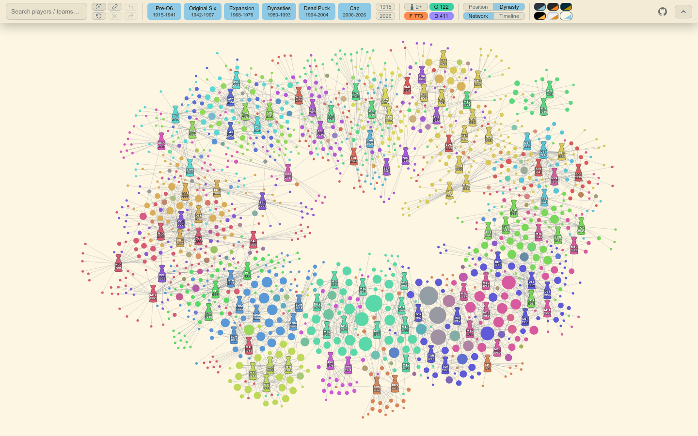
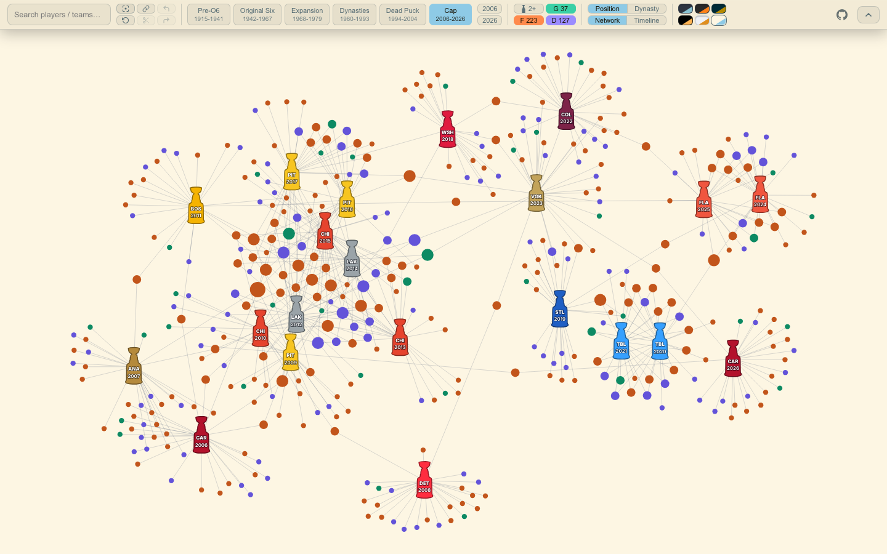
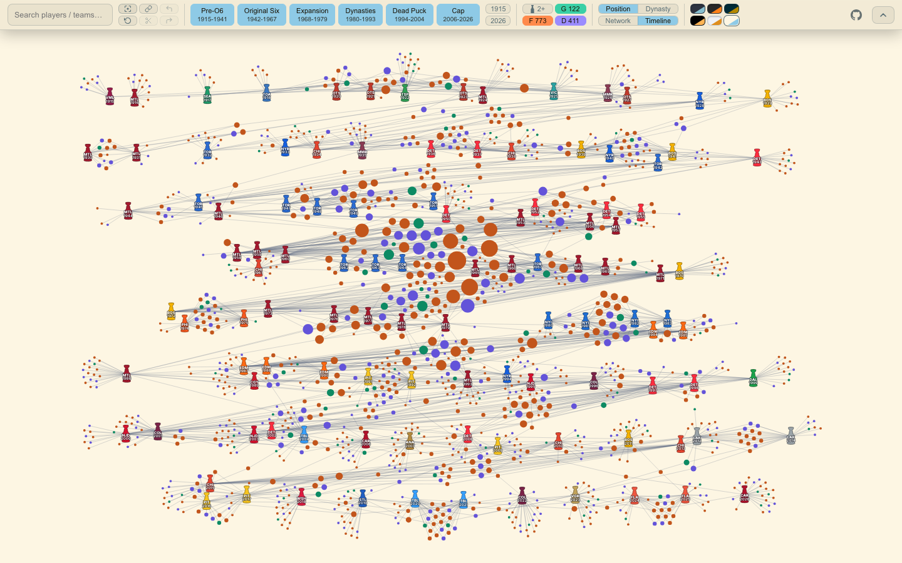
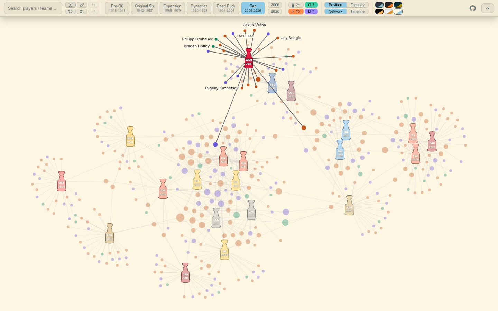
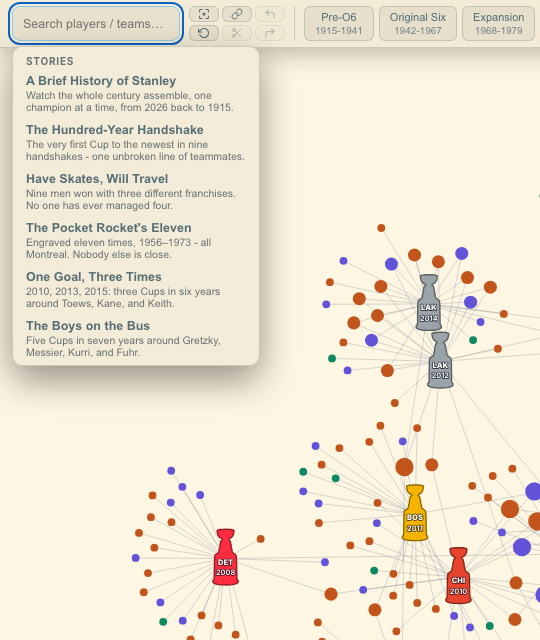
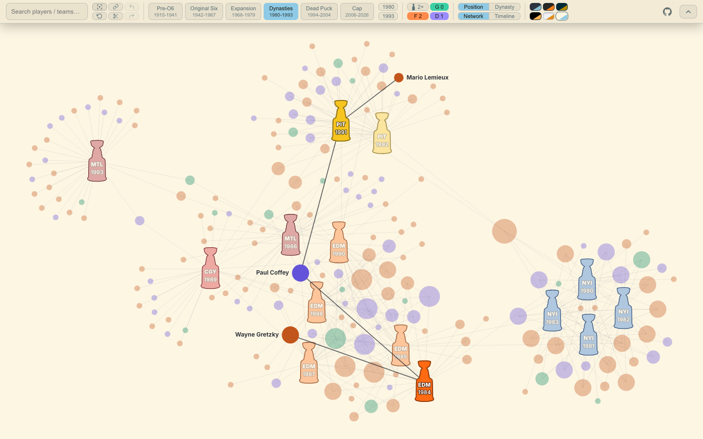
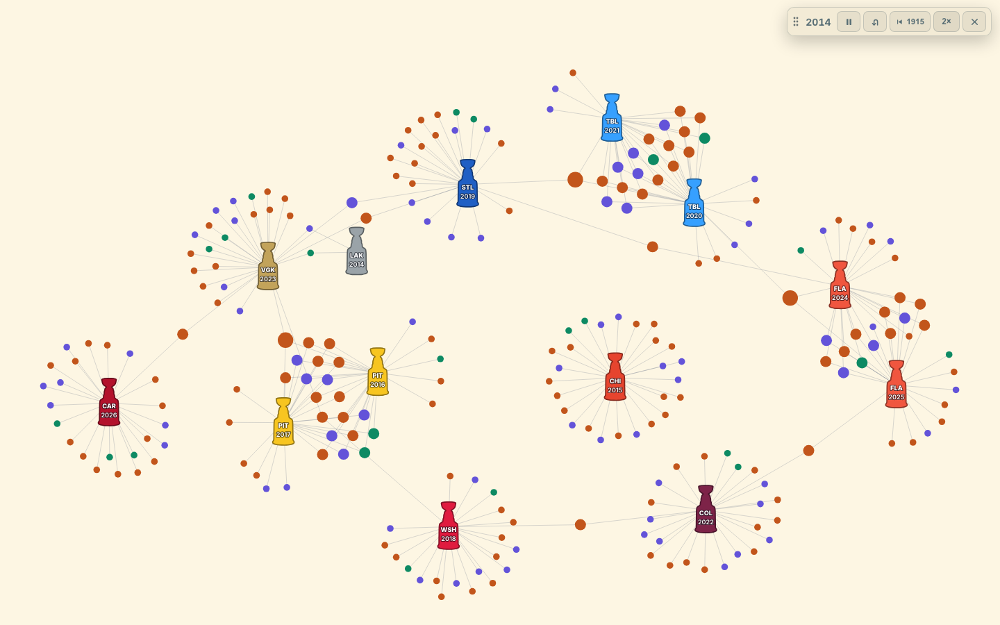
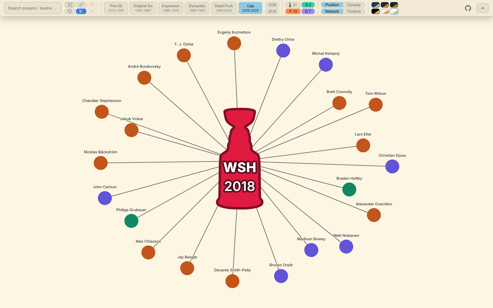
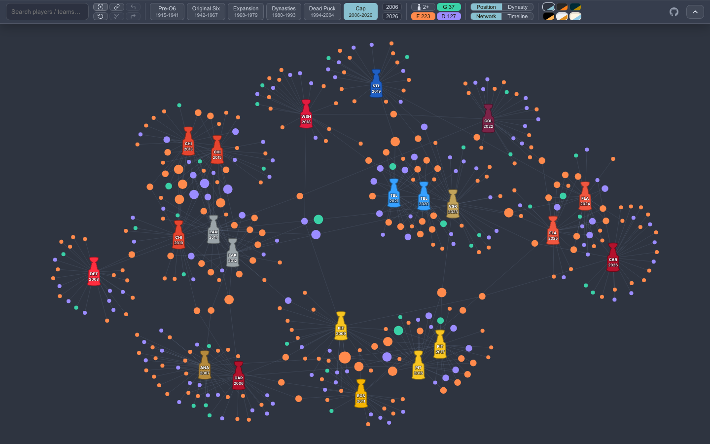
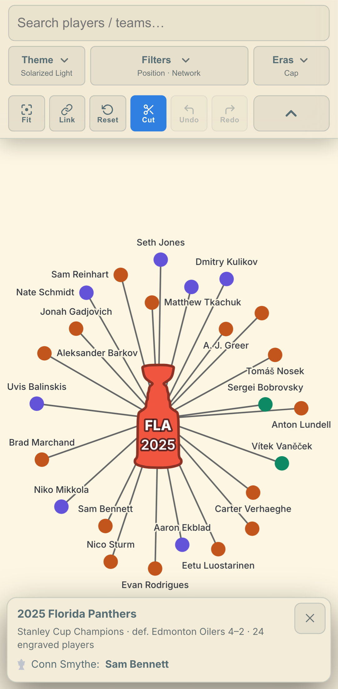

# Puckstory

**An interactive network graph of hockey's champions** - every player ever engraved on the
Stanley Cup (1915-2026) and the championship teams they won with, in one self-contained,
offline HTML file.

**Live at [puckstory.com](https://puckstory.com).**



Multi-Cup players are the hubs that tie eras and franchises together: one node per person, no
matter how many teams or decades they span. Hover a player for their full Cup history; select a
champion to light up its entire roster.

> Prefer a local copy? **Just open [`puckstory.html`](./puckstory.html)** in any browser. It is a
> single self-contained file (every library and the full dataset inlined at build time) and works
> completely offline.

## A few views

| Network (the default) | Timeline | Select a champion |
|:--:|:--:|:--:|
|  |  |  |
| The default view: the current era, one trophy per champion, players coloured by position (orange forwards, purple defense, green goalies). Bigger dots mean more Cups | Timeline layout: every champion since 1915 in order, each roster gathered around its Cup | Click a Cup (or pick anything from search) and its network lights up, names appearing where there is room; the rest of the era fades back |

| Stories | Six Degrees | A Brief History of Stanley |
|:--:|:--:|:--:|
|  |  |  |
| Click the empty search box for six curated starting points, each applied as one undoable step | Six Degrees: the shortest teammate chain between any two players or teams - here Lemieux to Gretzky through Paul Coffey - lit against the faded map | The playback story: the century assembles one champion at a time, with a floating transport to pause, reverse, jump between 1915 and 2026, or change speed |

## What you can do

Everything lives in a **top bar** (which condenses on phones: Theme / Filters / Eras collapse to
tappable summary rows):

- **Scope the era** - multi-select era pills (Pre-O6, Original Six, Expansion, Dynasties, Dead Puck,
  Cap) that **combine into a union**, so you can compare, say, the Original Six and the 1980s
  dynasties at once. Or type an exact **From / To** range. Filtering, counts, and node sizes all
  recompute instantly for the selection.
- **Filter** by position (the **F / D / G** pills, each filled with its node colour when shown) or
  **Multi-Cup only** (the **2+** pill).
- **Search** any player or team; picking from the dropdown **selects** that node (a player, or a
  team's whole set of Cups) and lights up its network. Matches the current view hides still
  surface - greyed, with a note about why and when they *did* win - and picking one still selects it.
- **Six Degrees** - the **6°** button on any search result arms a connector: pick a second player
  or team and the **shortest teammate chain** between them lights up (Lemieux → *1991 PIT* →
  Coffey → *1984 EDM* → Gretzky). Any eras the chain passes through switch on automatically.
  Only the chain itself highlights - a linking Cup appears without its whole roster - and the URL
  in your address bar reproduces it for anyone.
- **Stories** - click the empty search box for six curated starting points (the Hundred-Year
  Handshake, the Pocket Rocket's Eleven, the Boys on the Bus, the nine three-franchise winners,
  and more). Each is just a saved view, applied as one undoable step. The first, **A Brief
  History of Stanley**, is a playback: the whole century assembles champion by champion from
  2026 back to 1915, with a floating transport (drag it anywhere) to pause, reverse, jump
  straight to either end of history, or change speed. Escape or the ✕ ends the show.
- **Cut** (the scissors) keeps **only the selected network** and hides everything else: carve one
  franchise's story out of the whole league, then change eras to follow just those players around.
  Node sizes recompute to count only the Cups the cut shows. A cut never tears down by accident -
  background clicks are swallowed (the scissors pulses to show the way out), and on touch the node
  card carries explicit **Add to cut / Remove from cut** buttons.
- **Undo / redo** every filter, selection, and cut change - the ↶ / ↷ buttons, or Ctrl/Cmd+Z and
  Ctrl/Cmd+Shift+Z (Ctrl+Y works too). **Reset** starts truly over: default view, selection and
  cut cleared, history wiped.
- **Copy a link** to the exact view - the address bar mirrors every change live, and the Link
  button copies it (on touch devices it opens the system share sheet instead - see Deep links
  below).
- **Colour by** *Position* (F / D / G) or *Dynasty* - groups of players who kept winning
  together, found automatically from the data (computed once in the data pipeline and shipped
  with the dataset, so the clusters look identical for everyone). On the two light themes the
  position colours switch to darker shades so every dot stays easy to see.
- **Lay it out** as a *Network* (force-directed) or a *Timeline* (Cups placed chronologically in a
  wrapped grid, rosters clustering around them).
- **Fit** re-frames to the current selection.
- Pan, zoom, and drag nodes. Hover a player for their full per-Cup history (with captain and Conn
  Smythe markers); hover a champion for its runner-up **with the Final's series score**,
  engraved-player count, and Conn Smythe winner. On touch the card docks as a compact bottom sheet.
- Node size reflects **Cups won in the selected range** (or in the cut), so the legends grow into
  the super-hubs.
- Six **colour themes**, two light and four dark, each with its own personality (Solarized Light
  by default).
- Every empty state explains itself - no era selected, a cut emptied by the era change, a selection
  outside the current era - instead of leaving a blank or faded canvas.

| Cut mode | Six themes | On a phone |
|:--:|:--:|:--:|
|  |  |  |
| The scissors keeps just the selected network - here the 2018 Capitals, shareable as `?focus=cup-2018&cut=1` | The same map in Nord, one of six themes (two light, four dark) | Phones get a compact accordion bar, and node cards dock as a bottom sheet |

## Deep links

The URL works in **both directions**: the address bar live-updates as you explore (the Link button
copies it on desktop, or opens the system share sheet on touch), and any link reproduces the
exact view - filters, selection, and cut included:

```
?eras=1942-1967,1980-1993&color=dynasty&layout=timeline&multi=1
?from=1980&to=1993&pos=FD              # custom range, forwards + defense only
?focus=cup-1984                        # pre-select a champion (or ?focus=pl-<player-slug>)
?eras=2006-2026&focus=cup-2018&cut=1   # a cut: just that network, nothing else
```

## Stack

| Concern | Tool |
|---|---|
| Build / bundle | **Vite** + `vite-plugin-singlefile` (one portable HTML) |
| UI shell | **Svelte 4** + **TypeScript** |
| Layout physics | **d3-force** (nodes push apart, teammates pull together, collisions keep it tidy) drawn on **Canvas 2D** |
| Pan / zoom | **d3-zoom** |
| Dynasty clusters | **graphology** + `communities-louvain` - build-time only, in the data pipeline; not shipped in the bundle |
| Tests | **vitest** unit suite + **Playwright** e2e against the built file (desktop Chrome & Safari, phone portrait & landscape) |

```bash
npm install
npm run dev      # local dev server
npm run build    # -> dist/index.html, also refreshed as ./puckstory.html
npm run test     # vitest unit suite
npm run e2e      # Playwright end-to-end (builds first; runs against the real artifact)
npm run check    # svelte-check / TypeScript
```

`puckstory.html` is a copy of `dist/index.html`, refreshed automatically by `npm run build`,
so it never drifts from source.

## Data provenance (source of truth)

Rosters come from a **deterministic, fully reproducible pipeline** (every value is parsed from
Wikipedia, nothing invented), in [`data-pipeline/`](./data-pipeline):

1. **`build_full.py`** fetches each `"<year> Stanley Cup Final"` article (1915-2026) from the
   Wikipedia MediaWiki API and parses two things: the **`{{Stanley Cup champion}}` engraving
   template** into a roster (position and captaincy, staff excluded), and the
   **`{{Infobox Stanley Cup Final}}`** into the champion (the bolded winner) plus runner-up. The
   hardcoded champion list is **cross-checked against every infobox winner (0 mismatches)**. Raw
   wikitext is cached in `data-pipeline/wiki_cache/`, so the parse is fully reproducible and offline.
2. **`resolve_build.py`** keys **player identity on each engraving's Wikipedia wikilink target**,
   redirect-resolved to a canonical article (cached in `redirects.json`). This is the crux: the same
   person engraved under different names - `[[Patrick Maroon]]` vs `[[Patrick Maroon|Pat Maroon]]`,
   `Leonard [[Red Kelly]]`, `Lorne [[Gump Worsley]]` - collapses to **one node**, including across
   the 1967/68 expansion boundary. (Over 99.7% of engravings carry a link; the rest fall back to
   accent- and suffix-aware name matching.) Conn Smythe winners (1965+) and runner-ups round out
   each champion.
3. **`communities.mjs`** runs the seeded Louvain community detection (the dynasty clusters) over
   the resolved graph and writes the app's final `src/data/dataset.json` - it is the **only** step
   that writes it, so a data refresh is always
   `build_full.py → resolve_build.py → node communities.mjs`.

Validation: a **correlation audit** (`audit.py`) plus a verification pass over all 129 shared-surname
clusters and 67 high-Cup / long-span nodes, cross-checked against Wikipedia, found **0 wrong merges
and 0 over-merges** - e.g. Lee Fogolin **Sr. (1950)** and **Jr. (1984/85)** stay
correctly distinct, while **Henri Richard surfaces his record 11 Cups** and **Red Kelly his 8**
(Detroit and Toronto). An **external cross-check** against sources independent of the parsed
articles (records.nhl.com, hockey-reference, the Hockey Hall of Fame, band photographs) verified
all 110 champion/runner-up pairs and sampled rosters name-by-name; the two roster entries it
disproved (Ken Mallen 1915 and Al Smith 1967 - both on the championship roster but never actually
engraved) are excluded via `verified_overrides.json`. There was no Cup in **1919** (cancelled) or
**2005** (lockout); the challenge era (1893-1914) is excluded.
Result: **1,306 players, 110 champions, 2,307 engravings**.

## License

Puckstory is a mix of original code and Wikipedia-derived content, so the two are licensed separately:

- **Code** - [MIT](./LICENSE).
- **Data** (`src/data/dataset.json`) and the traced **Stanley Cup / Conn Smythe silhouettes** -
  [CC BY-SA 4.0](https://creativecommons.org/licenses/by-sa/4.0/). They are derived from Wikipedia
  (whose text is CC BY-SA 4.0) and a Wikimedia Commons photograph ("Stanley Cup, 2015", CC BY-SA 4.0);
  if you reuse the data or the artwork, attribute those sources and keep the same license.
- **Bundled font** - Inter by Rasmus Andersson, under the [SIL Open Font License 1.1](https://openfontlicense.org).
  See [THIRD-PARTY-NOTICES.md](./THIRD-PARTY-NOTICES.md) for the full list of bundled components.

No open source license grants trademark rights; see the disclaimer below.

## Disclaimer

Puckstory is an independent, non-commercial, informational project. It is **not affiliated with,
endorsed by, or sponsored by** the National Hockey League (NHL) or any of its member clubs. "Stanley
Cup" and all team names are trademarks of their respective owners, used here descriptively to
identify the historical champions and players the data is about. The Stanley Cup and Conn Smythe
Trophy silhouettes are traced from a Wikimedia Commons photograph ("Stanley Cup, 2015", CC BY-SA 4.0).
